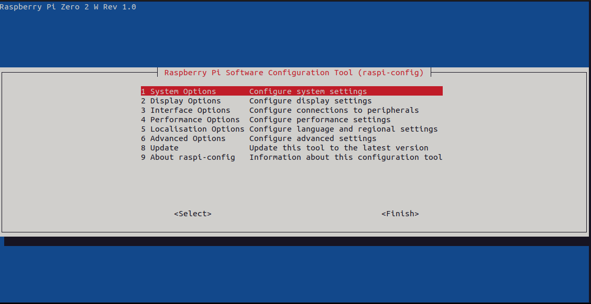
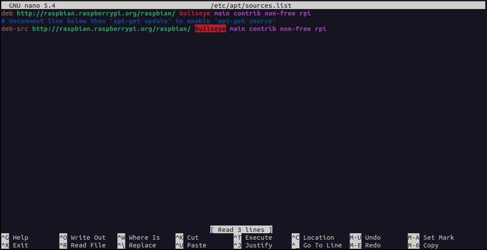
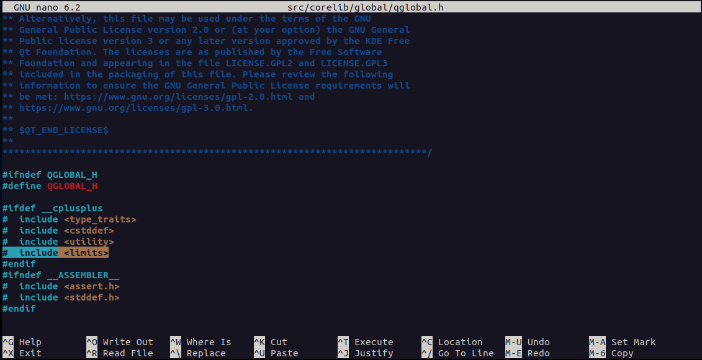
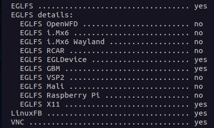
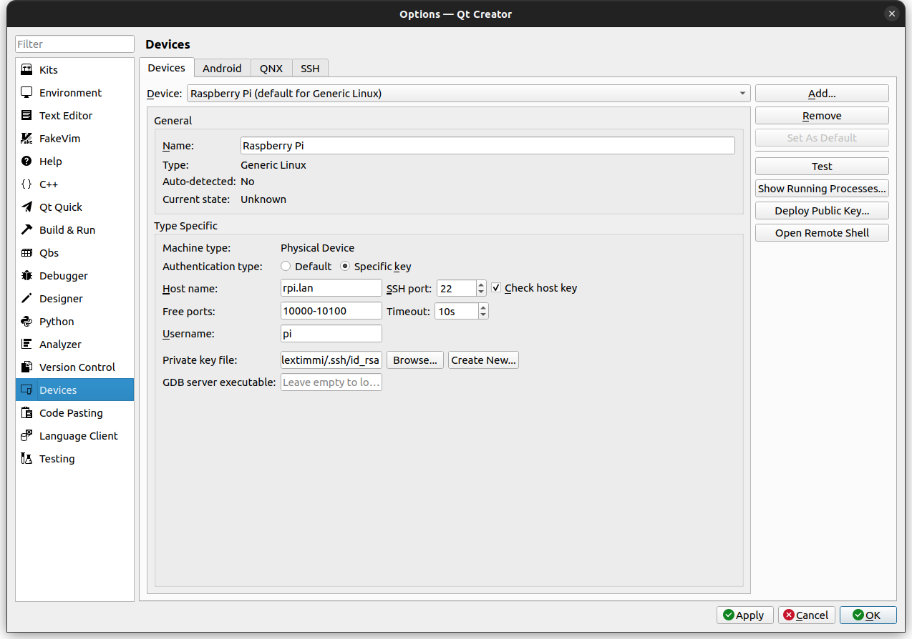
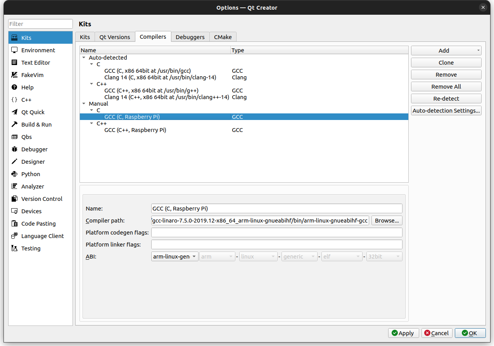
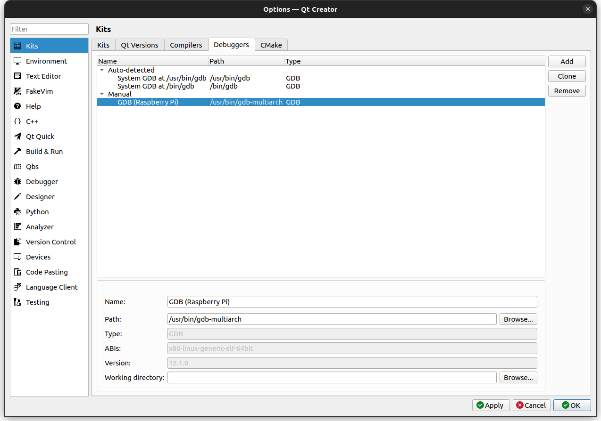
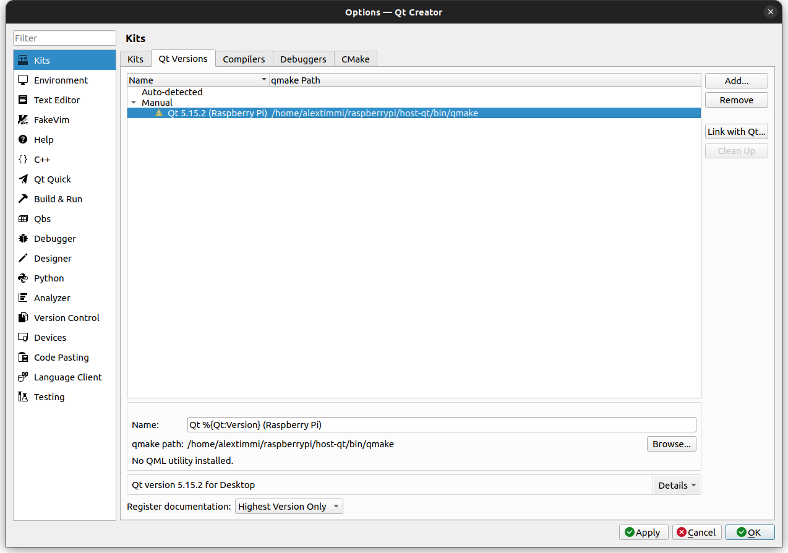
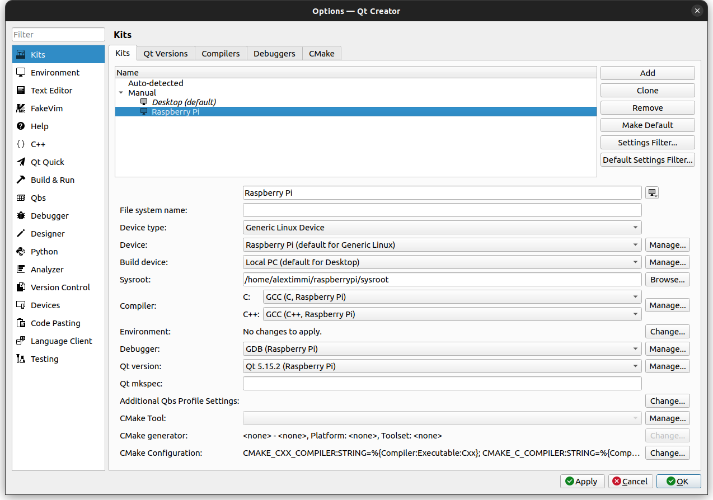

# Cross-Compiling Qt for Raspberry Pi 4
This guide documents the steps to corss-compile Qt 5.15.2 for the Raspberry Pi 4.

## Acknowledgments

Used the following guides for reference:

* https://mechatronicsblog.com/cross-compile-and-deploy-qt-5-12-for-raspberry-pi/
* https://www.tal.org/tutorials/building-qt-515-lts-raspberry-pi-raspberry-pi-os
* https://stackoverflow.com/questions/68081481/how-can-i-build-qt-5-13-2-with-gcc-11-1-on-windows
* https://github.com/UvinduW/Cross-Compiling-Qt-for-Raspberry-Pi-4

## Configure the Raspberry Pi
For our build we need to have SSH and GL (FAKE KMS) enabled. These can both be done through the `raspi-config` utility.  

On the Raspberry Pi terminal:

```sh
sudo raspi-config
```
	
A menu should pop up on your terminal


### Enable SSH

```sh
Interfacing Options -> SSH -> Yes
```
	
### Enable GL (FAKE KMS)

```sh
Advanced Options -> GL Driver -> GL (Full KMS) OpenGL desktop driver with full KMS
```

That should enable KMS. If you are using a minimal build, you may be prompted to download some updates before this option becomes available. If asked, do so.

### Enable Development Sources

```sh
sudo nano /etc/apt/sources.list
```
	
Uncomment the following line by removing the `#` character:

```sh
deb-src http://raspbian.raspberrypi.org/raspbian/ bullseye main contrib non-free rpi
```


	
### Update the system

```sh
sudo apt update
sudo apt upgrade
sudo reboot
```

### Install the required dependencies

```sh
sudo apt build-dep qt5-qmake libqt5gui5 libqt5webengine-data libqt5webkit5
```

### Install the required development packages

```sh
sudo apt install libudev-dev libinput-dev libts-dev libxcb-xinerama0-dev libxcb-xinerama0 gdbserver pkg-config mesa-utils libgles2-mesa-dev libdrm-dev libgbm-dev
```


### 9. Additional packages (Optional)

You can install these packages if you want additional multimedia and bluetooth capability with your QT binaries:

```sh
# additional (multimedia) packages
sudo apt install libjpeg-dev libpng-dev libtiff-dev
sudo apt install libavcodec-dev libavformat-dev libswscale-dev libv4l-dev
sudo apt install libxvidcore-dev libx264-dev openjdk-8-jre-headless
# audio packages
sudo apt install libopenal-data libsndio7.0 libopenal1 libopenal-dev pulseaudio
# bluetooth packages
sudo apt install bluez-tools
sudo apt install libbluetooth-dev
# gstreamer (multimedia) packages
sudo apt install libgstreamer1.0-0 gstreamer1.0-plugins-base gstreamer1.0-plugins-good gstreamer1.0-plugins-bad gstreamer1.0-plugins-ugly gstreamer1.0-libav gstreamer1.0-doc gstreamer1.0-tools gstreamer1.0-x gstreamer1.0-alsa gstreamer1.0-gl gstreamer1.0-gtk3 gstreamer1.0-qt5 gstreamer1.0-pulseaudio
sudo apt install libgstreamer1.0-dev  libgstreamer-plugins-base1.0-dev
```

### Create a directory for the Qt install

```sh
sudo mkdir /usr/local/qt
sudo chown pi:pi /usr/local/qt
```


## Configure PC

### Update the PC and install the required development packages

```sh
sudo apt update
sudo apt upgrade
sudo apt install build-essential libfontconfig1 mesa-common-dev libglu1-mesa-dev
sudo apt install git bison gperf python3 pkg-config gdb-multiarch
```

### Set up SSH keys to speed up connecting with the Raspberry Pi

Normally, everytime you connect from your PC to the RPi, you will need to provide the login credentials. We can use SSH keys to avoid this and speed up the process.

Check if there are any existing keys:

```sh
ls ~/.ssh
```

If any of the files are found as a result of the command execution:
* `id_rsa.pub`
* `id_dsa.pub`

This means that the keys are already present in the system. In this case, the generation step can be skipped

#### SSH key generation
    
```sh
ssh-keygen
```

#### Copy key to Raspberry Pi
[change *rpi.lan* with the IP address or hostname for your RPi]

```sh
ssh-copy-id pi@rpi.lan
```

### Create a folder on the host and download the toolchain for cross-compilation

```sh
mkdir ~/raspberrypi
cd ~/raspberrypi
wget https://releases.linaro.org/components/toolchain/binaries/latest-7/arm-linux-gnueabihf/gcc-linaro-7.5.0-2019.12-x86_64_arm-linux-gnueabihf.tar.xz
tar xf gcc-linaro-7.5.0-2019.12-x86_64_arm-linux-gnueabihf.tar.xz
```

### Creating a sysroot for cross-compiling under Raspberry Pi

```sh
mkdir sysroot sysroot/usr sysroot/opt
```

### Sync sysroot on PC with Raspberry Pi
[change *rpi.lan* with the IP address or hostname for your RPi]

```sh
rsync -avz pi@rpi.lan:/lib sysroot
rsync -avz pi@rpi.lan:/usr/include sysroot/usr
rsync -avz pi@rpi.lan:/usr/lib sysroot/usr
rsync -avz pi@rpi.lan:/opt sysroot
```

### Fix symbolic links
The files we copied in the previous step still have symbolic links pointing to the file system on the Raspberry Pi. We need to alter this so that they become relative links from the new sysroot directory on the host machine. We can do this with a downloadable python script.

To download it:

```sh
wget https://raw.githubusercontent.com/AlexTimmi/Cross-Compiling-Qt-RPi-4/main/scripts/sysroot-relativelinks.py
```

Make it executable and run:

```sh
sudo chmod +x sysroot-relativelinks.py
./sysroot-relativelinks.py sysroot
```

### Download the Qt sources

Use LTS version 5.15.2

```sh
git clone git://code.qt.io/qt/qtbase.git -b 5.15.2
cd qtbase
```

### Fix includ header

Since with GCC 11 some header dependencies have changed and Qt 5.15.2 does not always include the right headers.

Add the line `#include <limits>` within the `#ifdef __cplusplus` block to the file *src/corelib/global/qglobal.h*

Edit:

```sh
nano src/corelib/global/qglobal.h
```



### Perform configuration

For Raspberry Pi 4, the -device argument will be linux-rasp-pi4-v3d-g++

**Note:** *Under Bullseye, make sure to add the option: -no-feature-eglfs_brcm so that brcm libraries are not used*

```sh
./configure \
-release \
-opengl es2 -eglfs \
-device linux-rasp-pi4-v3d-g++ \
-no-feature-eglfs_brcm
-device-option CROSS_COMPILE=~/raspberrypi/gcc-linaro-7.5.0-2019.12-x86_64_arm-linux-gnueabihf/bin/arm-linux-gnueabihf- \
-sysroot ~/raspberrypi/sysroot \
-prefix /usr/local/qt \
-extprefix ~/raspberrypi/qt \
-hostprefix ~/raspberrypi/host-qt \
-opensource -confirm-license \
-skip qtscript \
-skip qtwayland \
-skip qtwebengine \
-ssl \
-evdev \
-nomake tests \
-make libs \
-pkg-config \
-no-use-gold-linker \
-v \
-recheck
```

Upon successful completion of this step, the following items should be activated in the console:
    


In case of a failed configuration or build, do not forget to perform a full cleanup before trying again:

```sh
git clean -dfx
```

### Make & install

```sh
make -j$(nproc)
make install
```

### Deploying built Qt on Raspberry Pi
[change *rpi.lan* with the IP address or hostname for your RPi]

```sh
cd ~/raspberrypi
rsync -avz qt pi@rpi.lan:/usr/local
```


## Qt Creator for Raspberry Pi

### Install

```sh
sudo apt install qtcreator
```

### Adding a device to Qt Creator

Go to the *Tools - Options* menu, open the *Devices* section and add the *Generic Linux Device*:



Here we set the device name, ip address or hostname and username. In addition, specify a private SSH key for accessing the Raspberry Pi via SSH.

### Add compilers to Qt Creator

Go to the *Kits* section on the *Compilers* tab and add compilers for C and C ++

Compiler paths:

C:
```
~/raspberrypi/gcc-linaro-7.5.0-2019.12-x86_64_arm-linux-gnueabihf/bin/arm-linux-gnueabihf-gcc
```

C++:
```
~/raspberrypi/gcc-linaro-7.5.0-2019.12-x86_64_arm-linux-gnueabihf/bin/arm-linux-gnueabihf-g++
```




### Add a debugger to Qt Creator

Pre-install:

```sh
sudo apt install gdb-multiarch
```

In the same section, on the *Debuggers* tab, add a debugger to work with Raspberry

Path:
```
/usr/bin/gdb-multiarch
```



### Add version to Qt Creator

Qt Versions tab

qmake path:
```
~/raspberrypi/host-qt/bin/qmake
```



### Add kit to Qt Creator

Kits tab

Sysroot:
```
~/raspberrypi/sysroot
```



When creating a new project, the created kit, which name *Raspberry Pi*, will be available.